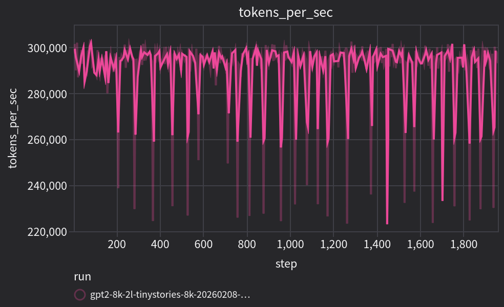
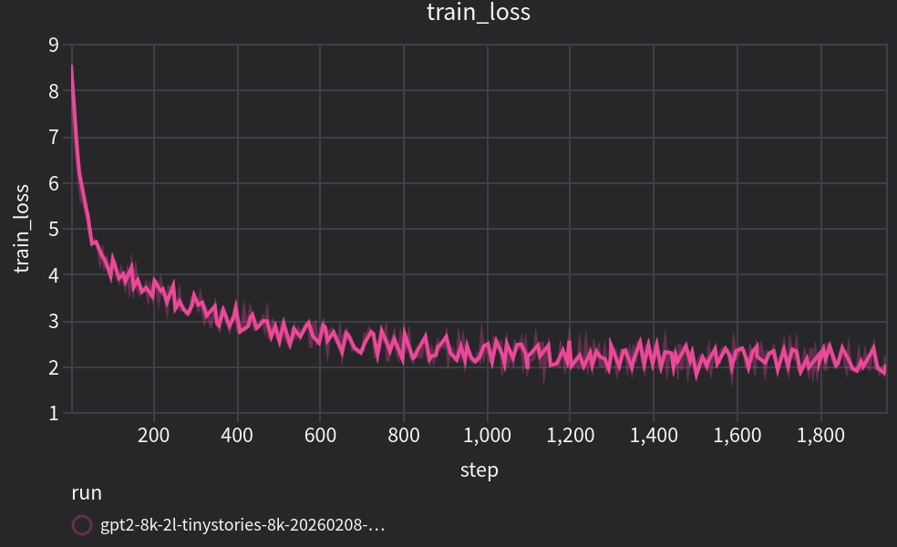
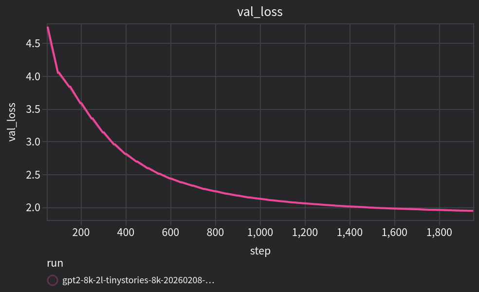
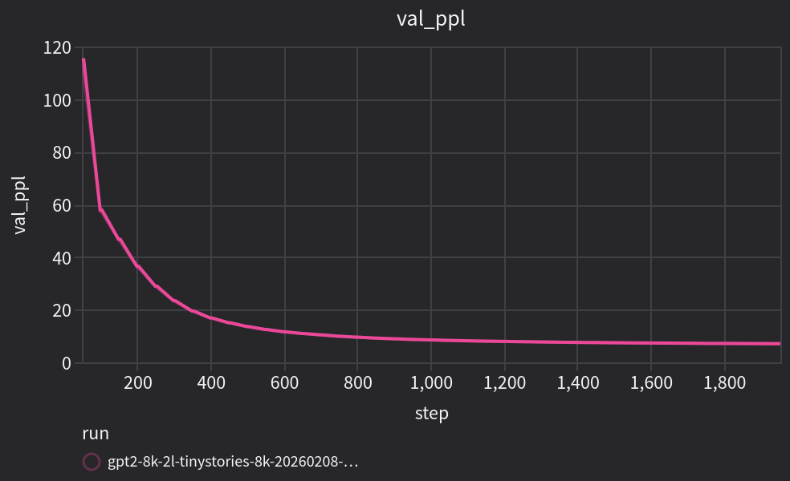

# tiny-lm

A learning-focused repo for pre-training small language models from scratch, end to end. It takes inspiration from [nanochat](https://github.com/karpathy/nanochat) but uses PyTorch Lightning and a structure that fits my style better.

## What is currently implemented

- GPT-2 implementation from scratch
- PyTorch Lightning for the training loop
- [rustbpe](https://github.com/karpathy/rustbpe) + tiktoken tokenizer training and inference artifacts
- Config-driven pipeline (model, data, tokenizer, training)
- Trackio for the monitoring

## Quick start

```bash
uv run python scripts/tokenizer/train_tokenizer.py
uv run python scripts/data/tokenize_data.py
uv run python scripts/training/train_gpt2.py
uv run python scripts/inference/generate.py
```

Each script has defaults and flags; take a quick look in `scripts/`.

Artifacts:
- Tokenizers: `tokenizers/`
- Tokenized data: `data/`
- Runs/checkpoints: `runs/`

## TinyStories run

As a starting point, I validated the code by training a 2-layer GPT-2 model using an 8k-vocab version of the [TinyStories dataset](https://huggingface.co/datasets/roneneldan/TinyStories) ([see paper](https://arxiv.org/pdf/2305.07759)).

It took ~25 minutes on an RTX 5090. I am sure it can be optimized.

| Tokens/sec | Train loss |
| --- | --- |
|  |  |

| Val loss | Val perplexity |
| --- | --- |
|  |  |

## Next steps

- Review and optimize the code
- Improve documentation
- Implement more modern architectures, starting with LLaMA-3

## Build your own

I encourage everyone to write their own version of this repo from scratch. You can use this one as inspiration if it helps (just as I did with nanochat). The important thing to me is learning how these models work and how the tokenization and training pipelines work. For serious stuff with multiple GPUs there are specialized libraries.
